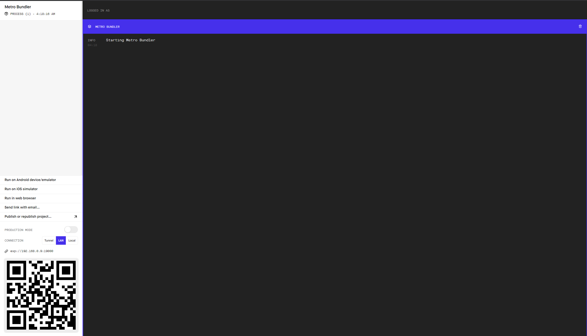
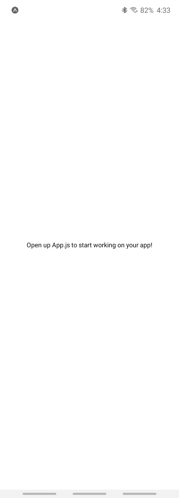

# 01. Pre-Requirements
<hr/>

## node.js 설치
<hr/>
- node.js 10.0 이상<br>
- npm 버전 6.0 이상
<hr/>

## expo
<hr/>

### expo 개요
<hr/>
스마트폰 어플리케이션과 작업 데스크탑에 동시 설치하고 계정 생성한다.

expo는 create-react-app과 같은 도구이다.
리액트 네이티브를 위한 설정 파일과 같은 것들이 없이 사전에 셋업된 애플리케이션 테스트 환경과 다양한 API를 제공한다. 안드로이드 스튜디오 설치하고, 개발자 모드 셋업하고 할 필요가 없다.
물론 리액트 네이티브 CLI 환경에서 작업할 수도 있으나, 후자의 방식은 네이티브 파일들에 보다 많은 컨트롤이 필요할 때 사용한다.

리액트 네이티브에서는 모든게 View 단위로 움직인다. HTML의 <div>와 같다고 보면 된다.
<View> 태그 안에 모든 text를 집어 넣어야 한다. <div>, <span>과 같은 태그를 사용하지 않는다.

```javascript
    <View style={styles.container}>
      <Text>Fucking React Native app!!!! :(((((</Text>
      <StatusBar style="auto" />
    </View>
```

리액트 네이티브는 CSS 엔진을 구현했기 때문에 CSS를 기존의 javascript object처럼 사용할 수 있다.
이를 StyleSheet API라고 부른다. 단, 모든 CSS를 동일하게 사용하지는 못한다.
어디까지나 이건 리액트 네이티브이기 때문에.
```javascript
const styles = StyleSheet.create({
  container: {
    flex: 1,
    backgroundColor: '#fff',
    alignItems: 'center',
    justifyContent: 'center',
  },
});
```


### expo 장점
<hr/>

- 1. live reloading
App.js로 테스트 해보면 안다.

```javascript
export default function App() {
  return (
    <View style={styles.container}>
      <Text>Fucking React Native app!!!! :(((((</Text>
      <StatusBar style="auto" />
    </View>
  );
}
```
위와 같이 App.js를 수정하고 저장하면 바로 splash screen에 적용되는 것을 확인할 수 있다.

- 2. 웹 기반의 애플리케이션 제작에 최적화
영세한 기업이나 개인은 네이티브 애플리케이션을 제작하고 운용할 여건이 부족하다.
다만 이들이 훌륭한 반응형 웹 사이트를 가지고 있고, 네이티브 기반의 몇 가지 기능정도가 필요한 상황이라면.
예를 들어 웹 상으로 이미 서비스하는 것이 따로 있고 스마트폰을 통해서 푸쉬 알림 정도만 보내고 싶다면
리액트 네이티브는 훌륭한 매개체 역할을 할 수 있다.

리액트 네이티브는 javascript와 IOS/Android 사이에서 서로를 이해하기 위한 '브릿지'를 만든다.
그래서 javacript를 이용해서 아이폰이나 안드로이드 폰의 core에 접근할 수는 있지만 중간에 브릿지가 있기 때문에
그만큼 작업 부하를 유발할 수 있다. javacript로 스마트폰을 제어하면서 발생하는 오버헤드로 이해하면 된다.
그래서 리액트 네이티브는 주로 컨텐츠를 다루는 간단한 애플리케이션 제작에 좋다. 데이팅 앱이나 인스타그램 같은.
리액트 네이티브를 이용해서 3D 게임같은 걸 만들기에는 부적합하다.


### expo 설치
<hr/>

``` shell command
npm install -g expo-cli
```
https://reactnative.dev/docs/environment-setup

### expo 프로젝트 생성

```shell command
expo init <project name> //사전에 작업하던 앱이 아니라면 blank 모드 선택
cd <project name>
npm start // or expo start
```
패키지 폴더 안의 app.json이 expo configuration 파일이다.



npm start하면 위와 같이 브라우저에서 metro bundler가 실행된다.
좌측 하단의 QR 코드를 스캔하면 안드로이드 앱에서 expo 앱이 프로젝트를 열고 앱을 테스트할 수 있게 된다.
안드로이드도 시뮬레이터로 보여주면 더 좋을텐데 하는 아쉬움이 남는다.


(내가 폴드2를 사용하고 있어서 화면 비율이 조금 신기한데)
이렇게 뜬 테스트 화면을 expo에서는 splash screen 이라고 부른다.
프로젝트 폴더의 splash.png를 변경하면 이 기본 스크린은 변경된다.

